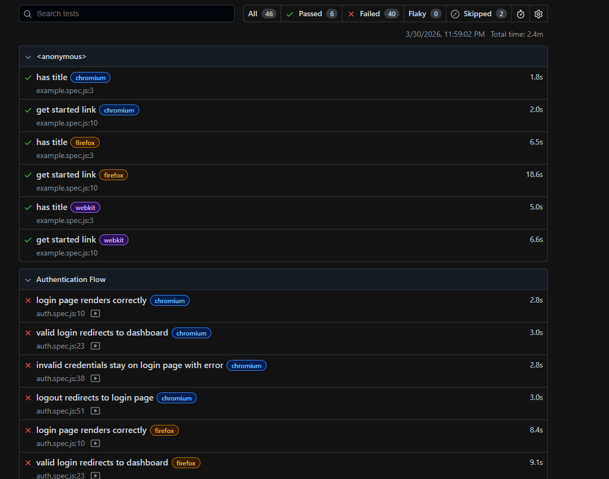
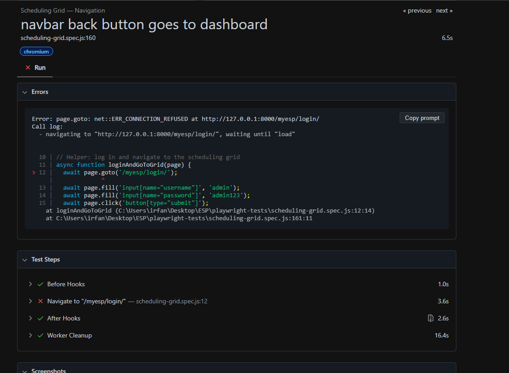
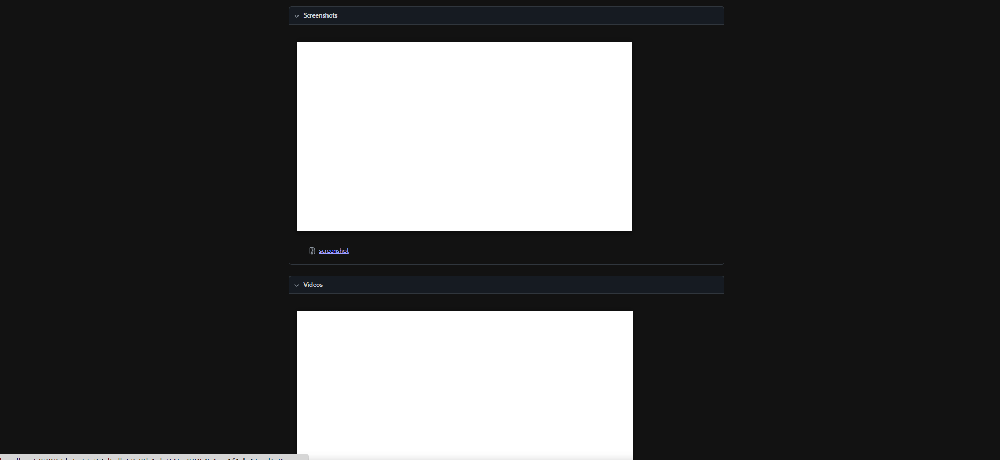

 Playwright Test Report Analysis
 Test Summary
Total tests: 46
Passed: 6 
Failed: 40 
Working Tests
Basic UI tests (title, link)
Working on all browsers
 Failing Tests
Login page rendering
Valid login redirect
Invalid login handling
Logout flow

Simple explanation:

Error: ERR_CONNECTION_REFUSED

Means:
Your test is trying to open
http://127.0.0.1:8000/myesp/login/
but server is not running

Simple explanation:

Screenshot is blank because
page never loaded

Reason:
Server is not running → so Playwright opened nothing → blank screen

give me in clean strcuture
